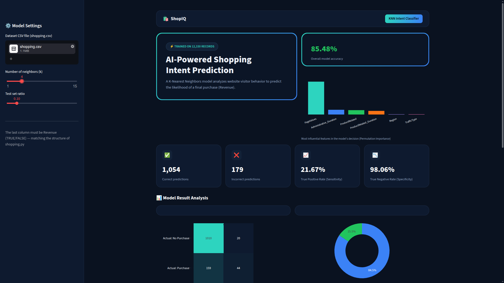
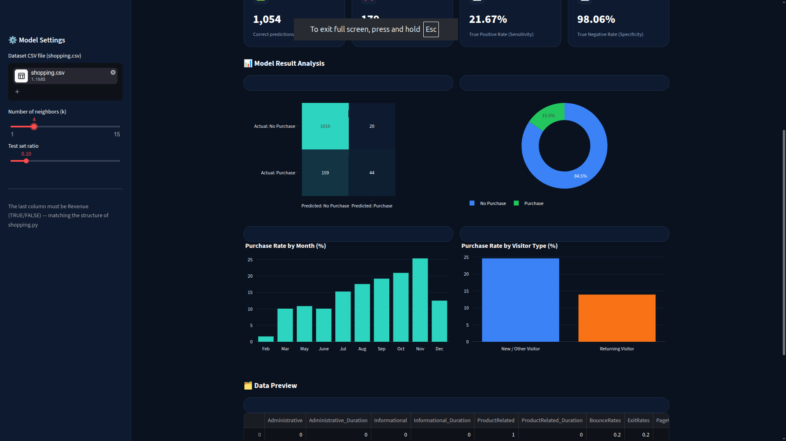

<p align="center">
  <!-- Replace this with your project logo -->
  
</p>

<h1 align="center">ShopIQ — Shopping Intent Analytics Dashboard</h1>

<p align="center">
  An AI-powered dashboard that predicts online shopping purchase intent using a K-Nearest Neighbors (KNN) classifier, built with Streamlit.
</p>

<p align="center">
  
  
  
  
</p>

---

## 📌 Overview

**ShopIQ** turns raw e-commerce session data into a clear, interactive analytics dashboard. It trains a **K-Nearest Neighbors (KNN)** classifier on the classic online shopping dataset to predict whether a website visitor will complete a purchase (`Revenue`), and visualizes the model's performance and the underlying customer behavior in real time — with no hardcoded or mock data. Every number shown is computed live from the dataset you upload.

The UI is styled as a dark, modern SaaS-style dashboard (navy background, teal-to-blue gradient accents), inspired by contemporary analytics product design.

---

## 🖼️ Screenshots

<!-- Add your screenshots below. Recommended: PNG, ~1400px wide -->

<p align="center">
  
</p>

<p align="center">
  
</p>

<p align="center">
  
</p>

---

## ✨ Features

- **Live model training** — upload any compatible CSV and train a fresh KNN model in-browser, no pre-computed results.
- **Adjustable hyperparameters** — tune the number of neighbors (`k`) and the train/test split ratio directly from the sidebar.
- **Real-time KPIs** — Correct / Incorrect predictions, Sensitivity (True Positive Rate), and Specificity (True Negative Rate).
- **Confusion matrix** — visual breakdown of prediction accuracy per class.
- **Feature importance** — permutation-importance chart highlighting which behavioral signals influence the model most (KNN has no native feature importance, so this is computed at evaluation time).
- **Behavioral analytics** — purchase-rate breakdowns by month and by visitor type (new vs. returning), computed directly from the uploaded dataset.
- **Data preview table** — quick look at the raw records feeding the model.
- **Locked, always-visible sidebar** — a fixed control panel for a consistent, distraction-free workflow.
- **Fully dark, gradient-themed UI** built with custom CSS on top of Streamlit.

---

## 🗂️ Project Structure

```
problem_set/
├── assets/               # Logo and screenshots used in this README
│   ├── logo.png
│   ├── screenshot-1.png
│   ├── screenshot-2.png
│   
├── data/                 # Dataset folder
│   └── shopping.csv      # Online shopping sessions dataset
├── dashboard.py          # Streamlit dashboard application (main entry point)
├── shopping.py           # Standalone script version: trains and evaluates the KNN model from the CLI
├── requirements.txt      # Python dependencies
├── LICENSE               # MIT License
└── README.md             # Project documentation
```

---

## 🧠 How It Works

### Dataset

The dataset lives in the **`data/`** folder as `data/shopping.csv`. This is the exact file the app expects — do not rename it or move it out of `data/` unless you also update the paths shown in the sections below.

**Column structure** — `shopping.csv` must contain the following columns, in this order, with the last column as the prediction target:

| Column | Description |
|---|---|
| `Administrative`, `Administrative_Duration` | Number and duration of administrative pages visited |
| `Informational`, `Informational_Duration` | Number and duration of informational pages visited |
| `ProductRelated`, `ProductRelated_Duration` | Number and duration of product-related pages visited |
| `BounceRates`, `ExitRates` | Google Analytics-style engagement metrics |
| `PageValues` | Average value of the page prior to a transaction |
| `SpecialDay` | Closeness of the visit to a special day (e.g. holidays) |
| `Month` | Month of the visit |
| `OperatingSystems`, `Browser`, `Region`, `TrafficType` | Technical/session metadata |
| `VisitorType` | New, Returning, or Other visitor |
| `Weekend` | Whether the visit occurred on a weekend |
| `Revenue` | **Target label** — whether the session ended in a purchase |

### Model

- **Algorithm:** `KNeighborsClassifier` (scikit-learn)
- **Evaluation metrics:**
  - **Sensitivity (True Positive Rate):** proportion of actual purchases correctly identified.
  - **Specificity (True Negative Rate):** proportion of actual non-purchases correctly identified.
  - **Accuracy:** overall proportion of correct predictions.
- **Feature importance:** computed via `sklearn.inspection.permutation_importance`, since KNN does not expose feature weights directly.

### CLI Script (`shopping.py`)

A lightweight, dependency-minimal script for running the same KNN pipeline from the command line. It takes one argument: the path to the dataset.

```bash
python shopping.py data/shopping.csv
```

Output includes correct/incorrect prediction counts and the True Positive/Negative rates — useful for quick experimentation without launching the dashboard.

---

## 🚀 Getting Started

### Prerequisites

- Python 3.9 or higher
- pip

### Installation

```bash
git clone https://github.com/seko369/shopIQ.git
cd shopIQ
pip install -r requirements.txt
```

### Running the Dashboard

```bash
streamlit run dashboard.py
```

This opens a local URL in your terminal, typically:

```
http://localhost:8501
```

### Using the Dataset in the Dashboard

1. Launch the dashboard with `streamlit run dashboard.py` as above.
2. In the **sidebar** on the left, locate the **"Dataset CSV file"** uploader.
3. Click it and select the file from the `data/` folder:
   ```
   data/shopping.csv
   ```
4. Once uploaded, the model trains automatically and every chart/KPI on the dashboard updates in real time.
5. Optionally adjust the sidebar controls to re-train instantly with different settings:
   - **Number of neighbors (k)** — controls the KNN model's `k` parameter.
   - **Test set ratio** — controls the train/test split percentage used for evaluation.
6. To analyze a different dataset, place your own CSV file inside the `data/` folder (matching the column structure above) and upload it the same way.

### Running the CLI Version

Run from the project root, passing the dataset path as an argument:

```bash
python shopping.py data/shopping.csv
```

---

## 📦 Dependencies

```
streamlit
pandas
numpy
scikit-learn
plotly
```

See [`requirements.txt`](./requirements.txt) for the full list.

---

## 🛠️ Tech Stack

| Layer | Technology |
|---|---|
| UI / Dashboard | [Streamlit](https://streamlit.io/), custom CSS |
| Data Handling | [pandas](https://pandas.pydata.org/), [NumPy](https://numpy.org/) |
| Machine Learning | [scikit-learn](https://scikit-learn.org/) (KNN, permutation importance) |
| Visualization | [Plotly](https://plotly.com/python/) |

---

## 📄 License

This project is licensed under the [MIT License](./LICENSE).

---


## 👨‍💻 Author & Contact

Developed by **Danial Ebrahimi**

Email : **danialebi1384@gmail.com**

[](https://github.com/seko369)

Feel free to reach out if you have any questions or suggestions for the project!